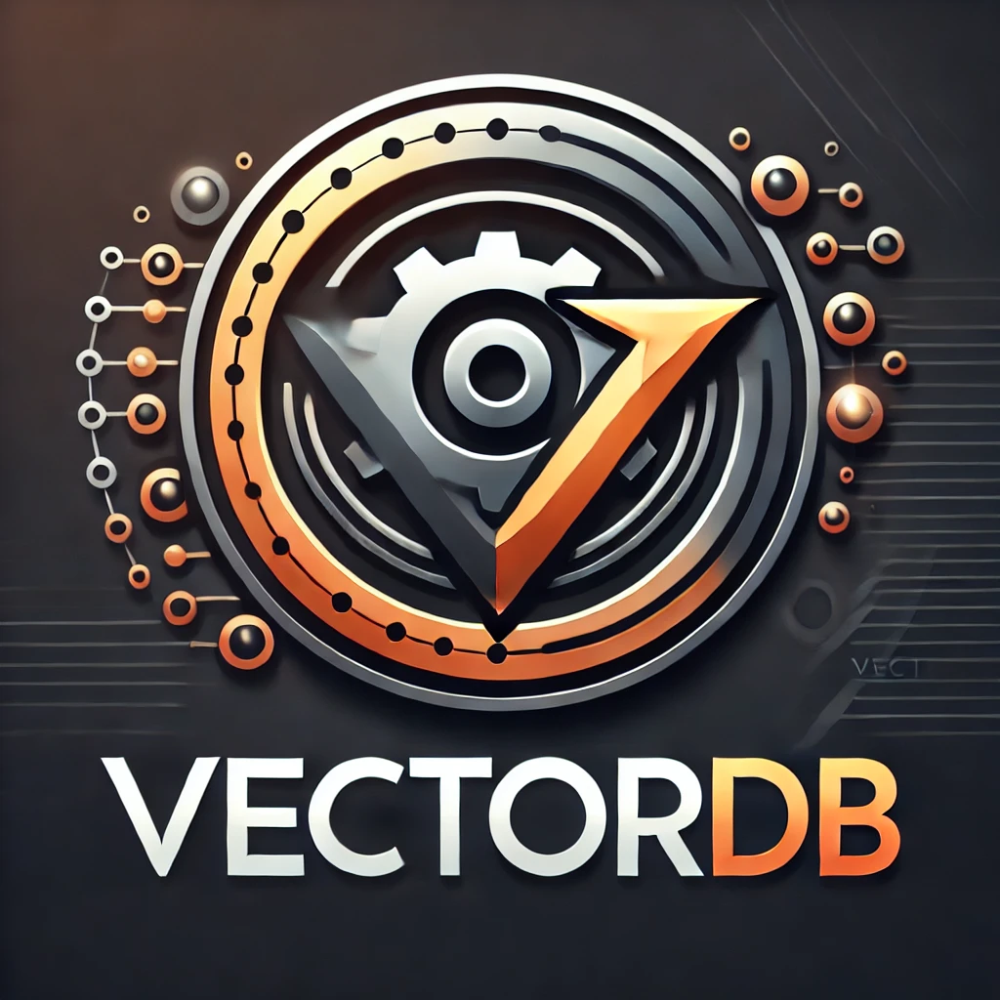

# VectorDB Python Client
<div align="center">
    
</div>

Python SDK for [VectorDB](https://github.com/Raghvender1205/VectorDB)

Currently, it can embed documents using `Langchain document loader and huggingface embeddings` then search through. See [here](https://github.com/Raghvender1205/VectorDBPythonClient/blob/master/examples/vectordb_langchain_embed_example.py)

The above file is having this issue while searching
```
ERROR:__main__:Error during search: [WinError 10061] No connection could be made because the target machine actively refused it
```
Fixing it asap!!

## TODO
1. Use Type Annotations and Data Validations
2. Test and fix the langchain `CustomVectorDBVectorStore`
3. Implement `as_retriever()` feature.
4. Search threshold for more relevant results
5. Logging
6. API Keys Middleware
7. Handle edge cases
8. Refine the examples
9. Implement pagination for search results
10. Delete document endpoint 
11. Allow to add similar documents in different collections
12. Metadata filtering inside a collection docs
13. Test Async client and examples. See [here](https://github.com/Raghvender1205/VectorDBPythonClient/tree/master/examples/async_client_test.py)

Implement `CustomVectorStore` for compatibility with `langchain`, `langgraph` etc. (Currently, not working)

https://github.com/langchain-ai/langchain/discussions/17238